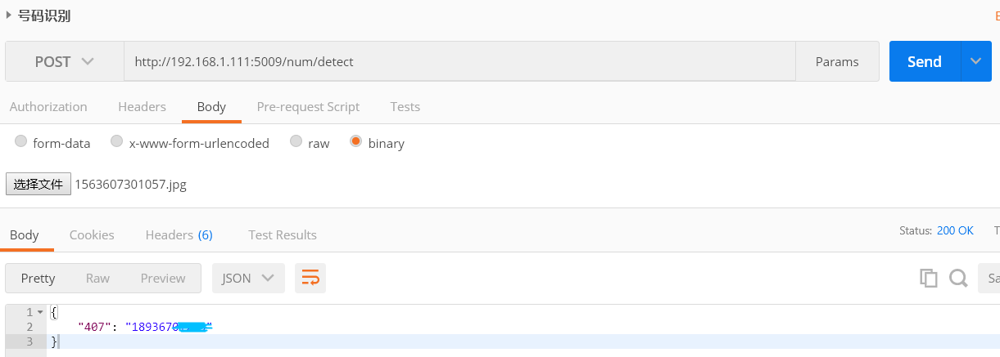

# 手机号识别REST-API

## Dependence
- Python3.6.4
- torch==1.0.1
- torchvision==0.2.2.post3
- tensorflow-gpu==1.12.2
- opencv-contrib-python==3.4.5.20
- flask==1.0.3
- flask-compress==1.4.0
- flask-cors==3.0.8
- flask-json==0.3.3
- RTX 2070 - Nvidia

## Run demo
``` sh  
python  reg_main.py  # 本地测试
python proj_main.py # 启动服务
```

## API


## 说明
```
本项目中文本检测模型使用的是tensorflow-gpu1.12.2版本，所以需要运行在cuda9环境下，这导致pytorch最高只能使用1.0.1版本，该版本torch在cuda9环境使用CUDNN会报错：“RuntimeError: cuDNN error: CUDNN_STATUS_EXECUTION_FAILED”，所以在初始化的时候关闭了CUDNN的使用，速度上虽有一定影响，但是平均在0.4秒左右，也能接受。
```

#### 更详细的信息请参考：深度学习实战--快递单手机号识别


